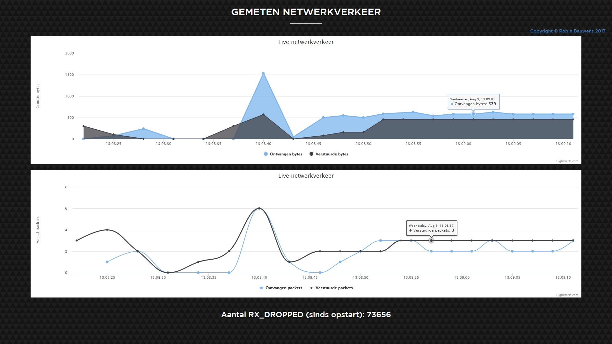
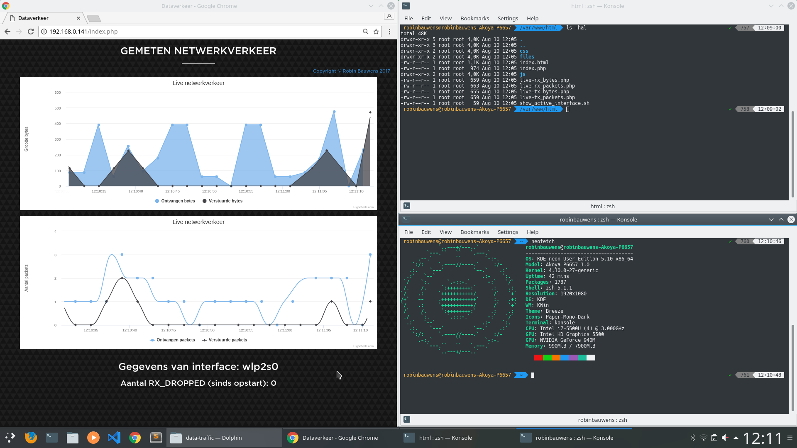

# Data traffic
Tonen van dataverkeer (verzonden en ontvangen bytes & IP-packets) van de actieve netwerkinterface.

Er worden een aantal statistieken (bestanden) beschikbaar gesteld (Linux) in `sys/class/net/$DEVICE/statistics`. Met `$DEVICE` bijvoorbeeld `eth0`, `lo` of `wlan0`.

Windows houdt deze statistieken bij in enkele commando's zoals `Get-NetAdapterStatistics` en `Get-NetAdapter`. Ook wordt er in de scripts op enkele virtuele interfaces gefilterd zoals die van VirtualBox zodat deze afgezonderd worden van de "echte", gebruikte netwerkinterfaces.

Bij deze applicatie zal er enkel gekeken worden naar de niet-virtuele en gebruikte netwerkinterface.

Werkt momenteel enkel voor UNIX-like systemen met package manager zoals Ubuntu/Debian (`apt-get`) en Windows. Indien je Fedora/CentOS gebruikt kan je `dnf` of `yum` gebruiken, voor Arch Linux `pacman`, etc. (let wel op de eventuele andere benaming).

- Windows: voert zelfgeschreven scripts uit.
- Linux: voert commando's uit die vooraf geïnstalleerd zijn.

De Windows-versie duurt ongeveer 15 seconden om te updaten, terwijl de Linux-versie daar minder dan 5 seconden over doet.

## Requirements:

- Windows: installeer XAMPP (aangeraden) om PHP te installeren, maak een directory `data-traffic` en kopieer alle bestanden van deze repository hierin. Je pad moet er zoiets uitzien: `D:\XAMPP\htdocs\data-traffic` en je kan de website raadplegen via `http://localhost/data-traffic/index.php`, `http://192.168.0.160/data-traffic/index.php` of `http://127.0.0.1/data-traffic/index.php` (of ander IP-adres tussen `127.0.0.1` en `127.255.255.254`).

- Linux: installeer alle programma's via `install_programs.sh` en bezoek een van de links hierboven.

### Getest op:

- Windows 10
- Raspbian
- KDE Neon

[Link voor documentatie class net statistics](https://www.kernel.org/doc/Documentation/ABI/testing/sysfs-class-net-statistics)

