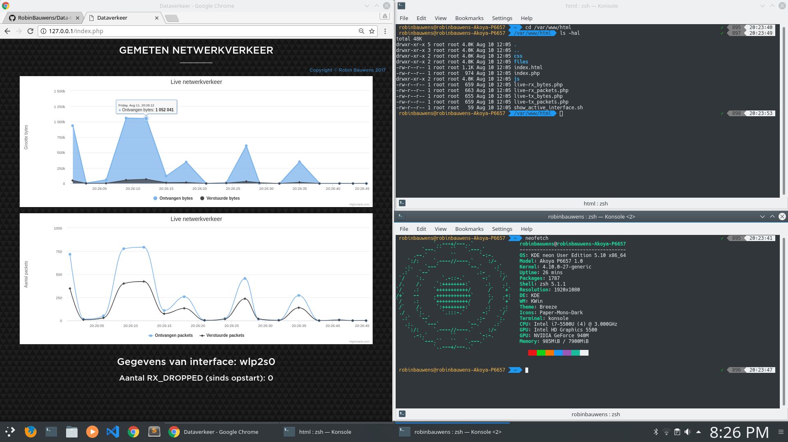

# Data traffic
Tonen van dataverkeer (verzonden en ontvangen bytes & IP-packets) van de actieve netwerkinterface.

De grafieken worden gegenereerd a.d.h.v. [HighCharts.js](https://www.highcharts.com/).

Linux: Er worden een aantal statistieken (bestanden) beschikbaar gesteld in `sys/class/net/$INTERFACE/statistics`. Met `$INTERFACE` bijvoorbeeld `eth0`, `lo` of `wlan0`.

Windows: Deze statistieken kunnen opgevraagd worden door enkele commando's zoals `Get-NetAdapterStatistics` en `Get-NetAdapter`. Ook wordt er in de scripts op enkele virtuele interfaces gefilterd zoals die van VirtualBox zodat deze afgezonderd worden van de "echte", gebruikte netwerkinterfaces.

Bij deze applicatie zal er dus enkel gekeken worden naar de niet-virtuele en gebruikte netwerkinterface.

Werkt momenteel enkel voor UNIX-like systemen met package manager zoals Ubuntu/Debian (`apt-get`) en Windows. Indien je Fedora/CentOS gebruikt kan je `dnf` of `yum` gebruiken, voor Arch Linux `pacman`, etc. (let wel op de eventuele andere benaming).

- Windows: voert zelfgeschreven scripts uit.
- Linux: voert commando's uit die vooraf geïnstalleerd zijn.

De Windows-versie duurt ongeveer 15 seconden om te updaten, terwijl de Linux-versie daar minder dan 5 seconden over doet.

Ondersteuning voor meerdere verbonden netwerkinterfaces (Wi-Fi en Ethernet) is momenteel nog WIP. **Windows-versie is afgewerkt.**

## Requirements:

- Windows: installeer en start XAMPP (andere stacks zoals WAMP zijn ook mogelijk) om PHP en Apache te installeren, kopieer directory [data-traffic van deze repository](https://github.com/RobinBauwens/Data-traffic/tree/master/files/data-traffic) hierin. Je pad moet er zoiets uitzien: `C:\XAMPP\htdocs\data-traffic` en je kan de website o.a. raadplegen via `http://localhost/data-traffic/index.php` of [http://127.0.0.1/data-traffic/index.php](http://127.0.0.1/data-traffic/index.php) (of ander IP-adres tussen `127.0.0.1` en `127.255.255.254`).

**Opmerking:** De code die in deze repository gebruikt wordt verwijst naar `D:\XAMPP\XAMPP\htdocs\` (zie PHP-code), dit zal afwijken van de standaardlocatie van de XAMPP installatie `C:\XAMPP\htdocs\`.

- Linux: installeer alle programma's (PHP en eventueel Apache) via `install_programs.sh`, kopieer directory [data-traffic van deze repository](https://github.com/RobinBauwens/Data-traffic/tree/master/files/data-traffic) naar `/var/www/html` **(root privileges nodig!)** en bezoek een van de links hierboven.

### Getest op:

- Windows 10 (via XAMPP)
- Raspbian
- KDE Neon

[Link voor documentatie class net statistics](https://www.kernel.org/doc/Documentation/ABI/testing/sysfs-class-net-statistics)

